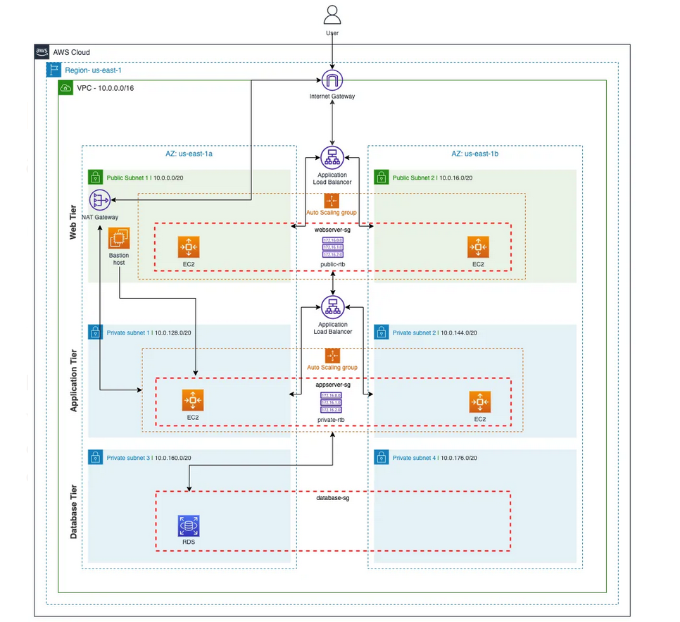

# Terraform AWS Infrastructure for 3-Tier Web Application


This repository provides a Terraform configuration for deploying a 3-tier web application infrastructure on AWS. The setup includes a scalable and secure environment that consists of a web tier, application tier, and database tier, all managed via a Jenkins pipeline.

## Overview

This infrastructure setup supports a 3-tier web application, which is designed to handle web traffic, application processing, and database operations. The setup includes:

1. **Web Tier**
   - **Public Subnets**: Hosts the web servers behind a Load Balancer.
   - **Auto Scaling**: Automatically adjusts the number of web servers based on traffic.

2. **Application Tier**
   - **Private Subnets**: Hosts application servers that process the business logic.
   - **Load Balancer**: Manages traffic distribution to the application servers.

3. **Database Tier**
   - **Private Subnets**: Hosts the RDS database instance.
   - **Security Groups**: Controls access between the application tier and the database.

## Jenkins Pipeline

The Jenkins pipeline is configured to take infrastructure details as inputs from the user, which include:

- AWS region
- Access credentials (Access Key, Secret Key, Session Token)
- VPC and subnet configurations
- EC2 instance details (AMI, instance type, key pair)
- Auto Scaling configuration (min, max, and desired sizes)
- RDS database details (instance type)

The pipeline performs the following steps:

1. **Creating `terraform.tfvars` File**: Generates a Terraform variables file with the inputs provided by the user.
2. **Initializing Terraform**: Prepares the Terraform environment for execution.
3. **Applying Terraform Configuration**: Deploys the infrastructure as defined by the Terraform scripts.

### New Features

The pipeline now includes an interactive prompt to choose between building or destroying the infrastructure. The options are:

1. **Build**: Initializes and applies the Terraform configuration to deploy the infrastructure as defined by the Terraform scripts.
2. **Destroy**: Destroys the existing infrastructure, removing all resources created previously.

## Usage

### Prerequisites

- **Terraform**: Install Terraform from [terraform.io](https://www.terraform.io/downloads.html).
- **Jenkins**: Ensure Jenkins is set up and configured with necessary plugins (e.g., Terraform Plugin).
- **AWS Account**: Configure your AWS credentials using AWS CLI or environment variables.

  **Note:** To ensure secure access, you must use an AWS profile that contains your access key and secret key. Follow these steps to create and configure your AWS profile:

  1. **Install AWS CLI**: Download and install the AWS CLI from [AWS CLI Installation](https://docs.aws.amazon.com/cli/latest/userguide/install-cliv2.html).
  
  2. **Configure AWS Profile**:
     ```bash
     aws configure --profile your-profile-name
     ```
     Enter your Access Key ID, Secret Access Key, default region, and output format when prompted. 

  3. **Set the AWS Profile in Jenkins**:
     Ensure Jenkins is configured to use the AWS profile by setting the profile name in the environment variables.


### Configuration

1. **Set Up Jenkins Pipeline**
   - Configure the pipeline to accept user inputs for infrastructure details.
   - Ensure that Jenkins has access to the necessary AWS credentials and Terraform configuration.

2. **Initialize and Apply Infrastructure**
   - Trigger the Jenkins pipeline to create and configure the infrastructure.
   - Review the pipeline logs and Terraform output to verify deployment.

3. **Managing Infrastructure**
   - Use Terraform commands to manage the infrastructure:
     ```bash
     terraform plan
     terraform apply
     terraform destroy
     ```

## Directory Structure

- `Jenkinsfile`: Defines the Jenkins pipeline for building and deploying the infrastructure.
- `main.tf`: Contains core Terraform configuration for the VPC, subnets, and resources.
- `variables.tf`: Defines variables used in the Terraform configuration.
- `outputs.tf`: Specifies output values for resources.
- `web-server.sh`: Script for initializing EC2 instances in the web tier.
- `app-server.sh`: Script for initializing EC2 instances in the app tier .

## Notes

- Ensure that your Jenkins environment is securely configured to handle sensitive information.
- Validate all user inputs to avoid misconfigurations.
- Consider using AWS Secrets Manager or SSM Parameter Store for sensitive data management.
